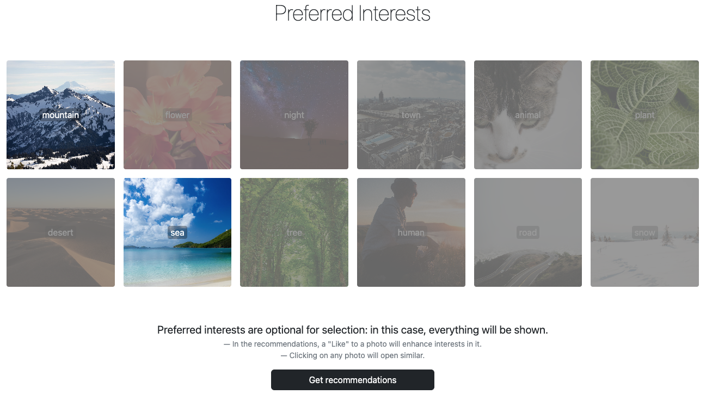
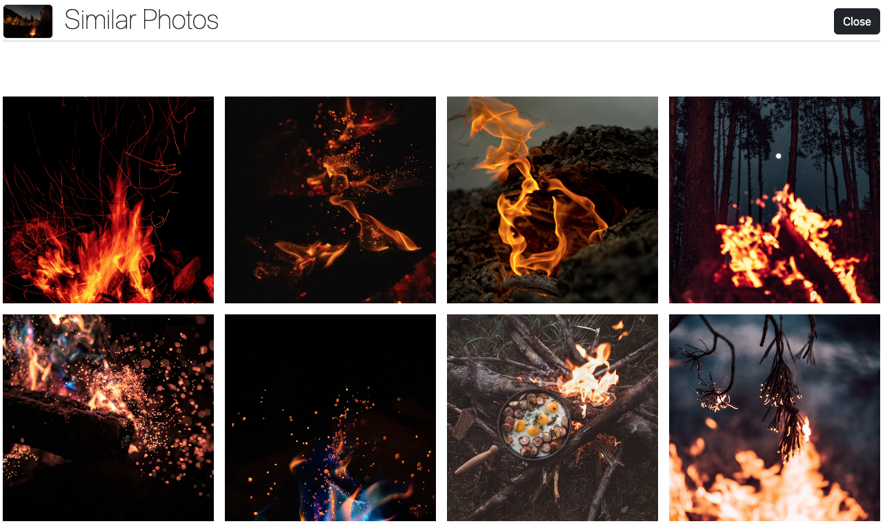

**Table of Content**

- [Introduction](#introduction)
- [How does it work?](#how-does-it-work)
- [Usage](#usage)
- [Repository Structure](#repository-structure)
- [PoC](#poc)
    * [Content-based filtering](#content-based-filtering)
- [Articles](#articles)

## Introduction

This repository contains descriptions of approaches for building recommendation systems using only algorithms (AI free). The main idea is to compare the categorical features of objects.

This approach can be used to build the following types of recommendation systems:
- Content-based filtering
- User-based collaborative filtering
- Combine both methods


## How does it work?

This solution is based on [cosine similarity](https://en.wikipedia.org/wiki/Cosine_similarity) algorithm.

Let's say we have two objects with classifiers and their features. From these objects, we can get intersection for the classifiers and place their features in both arrays.
But what do we do when we have classifiers that don't match?
We can add the missing classifier to the object, but with a zero feature.
Thus, the missing classifiers will increase the similarity distance between objects, while the present ones will bring them closer.

Consider the following example.
Let's say we have two movies with their genres:
- Grumpier Old Men (1995) - Comedy|Romance
- Waiting to Exhale (1995) - Comedy|Drama|Romance

We do not know the percentage distribution of genres in these films, then we will take them as 100% or 1.0 . Let's consider it for all genres.

Before comparison, we will combine all our genres and assign them features.
- Grumpier Old Men (1995) - [Comedy(1.0), Romance(1.0), Drama(0.0)]
- Waiting to Exhale (1995) - [Comedy(1.0), Romance(1.0), Drama(1.0)]

Now we can calculate their similarity coefficient through cosine similarity

```
[1.0, 1.0, 0.0] ~ [1.0, 1.0, 1.0] = 0.816497
```

The result of the similarity vectors can be checked using the online service https://www.omnicalculator.com/math/cosine-similarity

So, best match will be approximate to 1.0 and move away to 0.0 for the miss.


## Usage

I used the Neo4j graph database to check how it works. This algorithm was implemented as a plugin function for the Neo4j.

The API function to similar classifiers and their features is as follows
```cql
alg.classifiers.similar(<leftClassifiers>, <leftFeatures>, <rightClassifiers>, <rightFeatures>)
```

Where are the arguments:
- leftClassifiers - list of classifiers
- leftFeatures - list of features
- rightClassifiers - list of classifiers to similar with
- rightFeatures - list of features to similar with

Let's reproduce the example described above. But first, let's represent our generes through numerical values.
- Comedy - 1
- Romance - 2
- Drama - 3

Get the result of similar our films through the following expression
```cql
// 0.8164965809277259
return alg.classifiers.similar([1, 2], [1.0, 1.0], [1, 2, 3], [1.0, 1.0, 1.0])
```

And now imagine that we can express the genres in films through a percentage.
- Grumpier Old Men (1995) - Comedy|Romance as 50/50
- Waiting to Exhale (1995) - Comedy|Drama|Romance as 5/80/15

Then the result as follow:
```cql
// 0.173421993904824
return alg.classifiers.similar([1, 2], [0.5, 0.5], [1, 2, 3], [0.05, 0.15, 0.8])
```


## Repository Structure

```
<root>
  |
  +- code
  |   |
  |   +- neo4j-plugin #similarity algorithm packaged as java function plugin for the Neo4j 
  |   |
  |   +- demo-photo-recommender-backend #backend part for the demo
  |   |
  |   +- demo-photo-recommender-frontend #fronted part for the demo
  |
  +- deployament #empty deplyment Neo4j database with installed plugin for the examples
  |
  +- docs #documentation stuff, images etc.
  |
  +- examples #examples for articles below

```

## PoC

This section will present PoCs to showing how the approaches described above work.

### Content-based filtering

This PoC shows how a user can get a recommendation through context aware.
On the main page, the user is prompted to select interests to get recommendations.
If the preferred interests are not selected, then everything will be shown in this case.



After pressing the `Get recommendations` button, photo recommendations will be opened.


Only the 5 most popular keywords relevant to the user's interests will be shown in the header. Any keyword can be removed and it will affect to the recommendations.

Similar photos will be open after clicking on any photo.




The application was split into two files due to the 50MB limit for uploading large files.
Use the following commands to unpack them with the following commands:

```sh
zip -F demo-photo-recomminder.zip --out single-demo-photo-recomminder.zip
unzip single-demo-photo-recomminder.zip
```

After unpacking the archive, we can run it with the following command:

```sh
cd demo-photo-recomminder
docker-compose up
```

Then you need to wait for the Neo4j server and web application to start.
- Demo application will be available on `http://localhost:8080`
- Neo4j web server will be available at `http://localhost:7474` 

The dataset for the PoC was taken from an open source [Unsplash dataset](https://github.com/unsplash/datasets)

And the following tables/columns are included
- photos.photo_description
- photos.photo_image_url
- keywords.keyword (keyword for classifier)
- keywords.ai_service_1_confidence (accuracy as feature)

From the dataset, keywords were taken that had a accuracy of at least 65% and photos that had at least 5 keywords.
In total, the PoC included 21239 photos and 206350 relationships for the keywords.

## Articles

### Habr
- [Проектирование алгоритма под рекомендательную систему](https://habr.com/ru/articles/743986/)

### Medium
- [Easy way to build recommendation in Neo4J](https://medium.com/@divin.dmitry/easy-way-to-build-recommendation-in-neo4j-56b64eac28c3)

If you're interested in my work and want to contribute, you can [tip](https://www.paypal.com/donate/?hosted_button_id=YB9A5UNH7LB34) me. Thanks.
